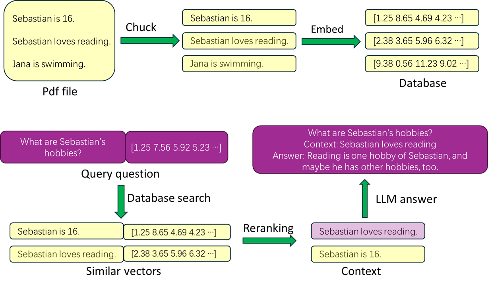

# BW_RAG

BW_RAG is a Retrieval-Augmented Generation (RAG) application designed to handle questions about German PDF documents.

## Background and Motivation

This project offers a completely free RAG solution that can run even on computers with average specifications.

## Principle Explanation

## Features

- Vectorize specified PDF files and store them in a database.
- Query relevant PDF content based on questions, providing context for the large language model to answer questions more accurately.
- Embedding and reranking are performed locally.
- Final inference uses Llama 3.0, conducted on Huggingface.

## Installation

1. Get your access to Llama-3 model by filling the table in https://huggingface.co/meta-llama/Meta-Llama-3-8B-Instruct.
2. Install the virtual environment as specified in `requirements.txt`.
3. Create an account on Pinecone and add a new index. Use the default settings with one key variable: set the Dimension to 768, as determined by the embedding model. If you are a developer planning to change the embedding model, adjust this setting accordingly. Add your index name and `pinecone_api_key` to the `.env` file.
4. Add your Huggingface token to the `.env` file.
5. Specify your cache folder path in the `.env` file, which will be used to store the large language model.

## Usage

1. Activate the virtual environment you created.
2. Run the following command in the terminal: streamlit run app.py
3. Follow the instructions provided by the running application, upload your pdf, Ask a question related to the PDF and press Submit!

## Contribution Guidelines

Special thanks to [Krishnaik06](https://github.com/krishnaik06/Complete-Langchain-Tutorials) for providing the RAG tutorial, from which we directly used some code; and thanks to [AIA-Education](https://www.aia-edu.de/) for supporting this project.

## License

This project is licensed under the Apache 2.0 License.
